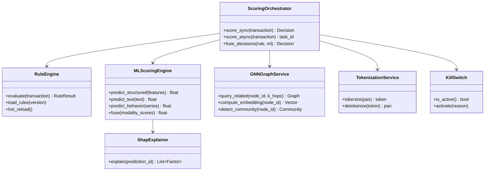

# FRD-D03 系统设计文档（SAD）

| 项 | 值 |
|---|---|
| 文档编号 | FRD-D03-V1.0 |
| 文档版本 | V1.0 |
| 编制日期 | 2026-07-27 |
| 文档状态 | 草稿 |

---

## 1. 设计概述

### 1.1 设计目标

- **实时性**：评分 P99 < 200ms / 集群 ≥ 10000 TPS
- **可解释**：双轨设计 + SHAP Top5 + 规则命中列表
- **可治理**：金丝雀 + 漂移 + 回滚 + Kill Switch（复用 DWS）
- **合规**：PCI-DSS v4.0 + 反洗钱 + 等保 2.0 三级
- **可观测**：Metrics/Logs/Traces + 业务指标实时看板

### 1.2 设计原则

| 原则 | 含义 |
|---|---|
| 双轨设计 | 规则引擎 + ML 引擎并行，任一触发即拦截 |
| 实时优先 | 同步评分 + 异步兜底 + Webhook 回调 |
| CDE 隔离 | 持卡人数据环境严格隔离（PCI-DSS）|
| Tokenization 优先 | 不存储明文 PAN，全链路 Token |
| 多级缓存 | Redis 缓存 + 进程内缓存 + 边缘缓存 |
| 失败优雅 | 4 层回退 + 断路器 + 降级 |
| 可观测内建 | 三支柱 + 黄金信号 + SLI/SLO |

### 1.3 技术栈选型表

| 维度 | 选型 | 备选 | 理由 |
|---|---|---|---|
| 后端框架 | FastAPI 0.115 | Spring Boot | async + 复用 DWS |
| ORM | SQLAlchemy 2.0 async | Django ORM | 复用 DWS |
| 数据库 | PostgreSQL 15 + TimescaleDB | MySQL | 时序扩展 + 复用 DWS |
| 图数据库 | Neo4j 5 Enterprise | JanusGraph | Cypher 成熟 + 千万级够用 |
| 缓存 | Redis 7 Cluster | Memcached | 复用 DWS pubsub |
| 消息队列 | Kafka 3.6 | RabbitMQ | 高吞吐 + 流处理 |
| 异步任务 | Celery 5.4 | RQ | 复用 DWS |
| 流处理 | 自研 Kafka Consumer | Flink | MVP 简化（V2 升级 Flink）|
| 前端 | Vue 3.5 + TS | React | 复用 DWS |
| ML | scikit-learn + PyTorch | TensorFlow | 复用 DWS |
| GNN | PyTorch Geometric | DGL | 与 PyTorch 一致 |
| LLM | OpenAI GPT-4 | Claude | API 简单 + 中文好 |
| 可观测 | Prometheus + Grafana + Loki | ELK | 复用 DWS |
| 容器 | Kubernetes 1.28 | Docker Compose | 金融场景强制 K8s 多可用区 |
| CI/CD | GitHub Actions | GitLab CI | 复用 DWS |

---

## 2. C4 架构模型

### 2.1 Context（系统上下文）

```
                ┌──────────────┐
                │ 风控分析师/经理│
                └──────┬───────┘
                       │ HTTPS
                       ▼
┌──────────┐   ┌──────────────┐   ┌──────────────┐
│ 客户交易网关│──▶│   FRD 系统   │──▶│ Tokenization │
└──────────┘   └──────┬───────┘   └──────────────┘
       ▲              │
       │              ▼
       │       ┌──────────────┐
       │       │   Neo4j 图库  │
       │       └──────────────┘
       │              │
       ▼              ▼
  ┌─────────┐   ┌─────────┐   ┌──────────┐
  │ Webhook │   │ AML 报送 │   │ 反洗钱中心│
  └─────────┘   └─────────┘   └──────────┘
```

### 2.2 Container（容器视图）

| 容器 | 技术 | 职责 |
|---|---|---|
| Web Frontend | Vue 3 + Vite + PWA | 三端 UI + WebSocket |
| API Gateway | FastAPI + Uvicorn | REST + WebSocket + 限流 |
| Scoring Service | FastAPI + 自研 Kafka Consumer | 实时评分主路径 |
| Rule Engine | Python + 自研 DSL | 规则匹配 + 双轨决策 |
| ML Engine | scikit-learn + PyTorch | 多模态评分 + SHAP |
| GNN Service | FastAPI + Neo4j Driver | 图查询 + GraphSAGE |
| Worker | Celery Worker | 异步任务（训练/批量/报表）|
| Scheduler | Celery Beat | 定时任务 |
| Stream Processor | Kafka Consumer | 实时流处理 |
| Database | PostgreSQL + TimescaleDB | 业务数据 + 时序 |
| Graph DB | Neo4j 5 Enterprise | 账户-商户-设备关系图 |
| Cache | Redis Cluster | 缓存 + pubsub + 限流 |
| Message Queue | Kafka 3.6 | 交易流 + 事件流 |
| Object Storage | 阿里云 OSS | 备份 + 模型工件 |
| LLM Proxy | OpenAI API | 申诉文本分析 |
| Monitoring | Prometheus + Grafana + Loki | 指标/日志/可视化 |

### 2.3 Component（评分主路径组件图）

```
┌─────────────────────────────────────────────────────────┐
│              Scoring Service (FastAPI)                   │
│                                                          │
│  ┌──────────────────────────────────────────────────┐  │
│  │  Middleware: Auth + Rate Limit + Tenant + Audit  │  │
│  └──────────────────────────────────────────────────┘  │
│  ┌──────────────────────────────────────────────────┐  │
│  │            Scoring Orchestrator                  │  │
│  │  1. Tokenization 卡号                             │  │
│  │  2. 并行：规则引擎 + ML 引擎                       │  │
│  │  3. 双轨决策融合                                  │  │
│  │  4. SHAP 计算（异步）                              │  │
│  │  5. 缓存 + Kafka 发布                             │  │
│  └──────────────────────────────────────────────────┘  │
│  ┌─────────────┐  ┌─────────────┐  ┌─────────────┐   │
│  │ Rule Engine │  │  ML Engine  │  │ GNN Service │   │
│  │ - DSL 解析  │  │ - 三模态融合 │  │ - Cypher 查询│   │
│  │ - 命中返回  │  │ - LightGBM  │  │ - GraphSAGE │   │
│  └─────────────┘  └─────────────┘  └─────────────┘   │
│  ┌─────────────┐  ┌─────────────┐  ┌─────────────┐   │
│  │ Cache Layer │  │ Kafka Prod  │  │ Audit Log   │   │
│  └─────────────┘  └─────────────┘  └─────────────┘   │
└─────────────────────────────────────────────────────────┘
```

### 2.4 Code（核心模块类图）



---

## 3. 架构决策记录（ADR）

### ADR-001 双轨决策（规则 + ML）

- **上下文**：ML 模型可解释性弱，金融场景需可解释
- **决策**：规则引擎 + ML 引擎并行，任一触发 block 即 block
- **备选**：纯 ML / 纯规则 / ML 为主规则兜底
- **理由**：规则保证可解释性与监管合规；ML 提升召回率
- **后果**：双轨延迟需并行优化；规则与 ML 决策需融合策略

### ADR-002 评分同步 + 异步兜底

- **上下文**：客户要求 P99 < 200ms，但部分场景需深度分析
- **决策**：同步返回主决策 + 异步 Webhook 推送深度分析（SHAP/图关联）
- **备选**：纯同步 / 纯异步
- **理由**：用户体验优先（200ms 内决策）；深度分析异步
- **后果**：Webhook 必须可靠（重试 + 死信队列）

### ADR-003 图数据库选择 Neo4j

- **上下文**：千万级节点 + 多关系图查询
- **决策**：Neo4j 5 Enterprise + Cypher
- **备选**：JanusGraph / TigerGraph / 关系表存储
- **理由**：Cypher 成熟；社区生态好；千万级性能足够
- **后果**：增加图数据库运维成本；需 Neo4j Enterprise 授权（生产）

### ADR-004 流处理 MVP 阶段用 Kafka Consumer

- **上下文**：实时流处理（窗口聚合）需求
- **决策**：MVP 用 Kafka Consumer 自研；V2 升级 Flink
- **备选**：直接上 Flink / Spark Streaming
- **理由**：MVP 简化 + 团队无 Flink 经验；Trae AI 辅助可降低自研成本
- **后果**：自研窗口/状态机可能不稳定；V2 需重构

### ADR-005 卡号 Tokenization 替代明文

- **上下文**：PCI-DSS 强制不存储明文 PAN
- **决策**：接入 Tokenization 服务（自建 or 阿里云 KMS）
- **备选**：加密存储 + 严格访问控制
- **理由**：Tokenization 让 CDE 范围最小化；降低 PCI-DSS 评估范围
- **后果**：增加调用延迟（< 10ms 可接受）；Tokenization 服务需 HA

### ADR-006 多可用区双活部署

- **上下文**：金融场景 SLA 99.95%
- **决策**：K8s 多可用区部署 + 数据库主从跨可用区
- **备选**：单可用区 + 异地灾备
- **理由**：金融场景 RTO < 15min；多可用区双活最优
- **后果**：成本翻倍；数据一致性需 Paxos/Raft 协议

### ADR-007 SHAP 异步计算 + 缓存

- **上下文**：SHAP 计算耗时 200-500ms，影响主路径
- **决策**：SHAP 异步计算 + 缓存 24h
- **备选**：同步计算 / 预计算
- **理由**：用户体验优先（200ms 内决策）；SHAP 异步推送
- **后果**：首次查询无 SHAP；缓存命中率 > 80%

### ADR-008 复用 DWS 模型治理模块

- **上下文**：金丝雀 + 漂移 + 回滚 + Kill Switch
- **决策**：复用 DWS canary_controller + drift_detector + kill_switch + fallback_hierarchy
- **备选**：自建 / K8s Service Mesh
- **理由**：DWS 模块经审计验证；满足 5/25/100 三阶段发布
- **后果**：金丝雀观察期 72h（金融场景可延长至 7 天）

### ADR-009 PCI-DSS 隔离区设计

- **上下文**：PCI-DSS 要求 CDE 严格隔离
- **决策**：独立网络段 + 独立 K8s 命名空间 + 独立审计
- **备选**：全系统进入 CDE（评估范围大）
- **理由**：CDE 范围最小化降低评估成本
- **后果**：跨 CDE 数据传输需加密 + 审计

### ADR-010 4 层回退策略

- **上下文**：ML 主模型可能失败
- **决策**：主 ML → 备用 ML → 规则引擎 → 启发式
- **备选**：仅规则 / 仅 ML
- **理由**：金融场景不可中断；多层保证可用性
- **后果**：4 层监控需全覆盖；切换需断路器

---

## 4. 核心模块设计

### 4.1 评分主路径（ScoringOrchestrator）

```
请求处理流程（同步评分）:
  1. 中间件: Auth + Rate Limit + Tenant + Audit
  2. Tokenization: 卡号 → Token (5ms)
  3. 并行评分:
     ├── Rule Engine (10ms)
     │   - 加载规则版本
     │   - DSL 解析匹配
     │   - 输出: {hit_rules: [...], action: block/review/allow}
     └── ML Engine (50ms)
         - 缓存检查 (1ms)
         - 缓存命中 → 返回
         - 缓存未命中:
           - structured 模态 (LightGBM, 20ms)
           - text 模态 (BERT, 30ms)
           - behavior 模态 (1D-CNN, 25ms)
           - 三模态融合 (5ms)
  4. 双轨决策融合 (5ms):
     - 任一 block → block
     - 任一 review → review
     - 双 allow → allow
  5. 缓存写入 + Kafka 发布 (5ms)
  6. 异步: SHAP 计算 + 案件生成
  7. 响应客户 (P99 < 200ms)
```

### 4.2 规则引擎（Rule Engine）

```
规则 DSL（YAML）:
  rule:
    id: R001
    name: "大额异地交易"
    version: "v1.2"
    enabled: true
    expression: |
      amount > 50000 AND
      merchant_city != user.city AND
      time_since_last_transaction < 60
    action: review
    priority: 80
    explanation: "金额超 5 万且异地且 1 分钟内连续交易"

执行流程:
  1. 加载规则版本（Redis 缓存）
  2. 表达式编译（CEL/Python eval）
  3. 短路求值（按优先级）
  4. 输出命中规则列表

热更新:
  - 规则版本表 + Redis pubsub
  - 不重启加载新版本
  - 灰度发布（先 5% 流量）
```

### 4.3 多模态 ML 评分（复用 DWS fusion_engine）

```
输入:
  - structured_features: dict (金额/时间/商户/设备/历史)
  - text_content: str (备注/对话)
  - behavior_series: List[float] (点击流/输入节奏)

处理:
  1. structured → LightGBM → score_struct
  2. text → BERT (金融微调) → score_text
  3. behavior → 1D-CNN + IsolationForest → score_behavior
  4. fusion_priority_engine 加权:
     weights = {struct: 0.6, text: 0.2, behavior: 0.2}
  5. Stacking 元学习器融合

输出:
  - risk_score: int (0-100)
  - decision: allow/review/block
  - modality_scores: dict
```

### 4.4 GNN 团伙检测

```
图数据建模:
  节点类型:
    - Account (账户)
    - Merchant (商户)
    - Device (设备指纹)
    - IP (IP 地址)
    - Card (卡号 Token)
  
  关系类型:
    - (Account)-[:USES]->(Device)
    - (Account)-[:PAYS_TO]->(Merchant)
    - (Account)-[:FROM_IP]->(IP)
    - (Card)-[:BINDS_TO]->(Account)
    - (Device)-[:SHARES_WITH]->(Account)

实时查询（P99 < 2s）:
  - 输入: 交易涉及的账户/设备/IP
  - 查询: k 跳关联节点 + 社区标签
  - 输出: 关联风险分（基于历史欺诈比例）

离线计算（每日）:
  - GraphSAGE 训练节点嵌入
  - 社区发现（Louvain/Leiden）
  - 中心性分析（PageRank/Degree）
  - 嵌入写入 PostgreSQL + Redis 缓存

团伙识别:
  - 社区欺诈率 > 30% → 标记为欺诈团伙
  - 新交易落入团伙社区 → 加权风险分
```

### 4.5 模型治理（复用 DWS）

复用 DWS 的：
- `app/ml/canary_controller.py` - 金丝雀发布（金融场景观察期延长至 7 天）
- `app/services/drift_detector.py` - PSI/KL 漂移检测
- `app/core/kill_switch.py` - 一键关停 ML（规则引擎兜底）
- `app/core/fallback_hierarchy.py` - 4 层回退
- `app/ml/model_registry_v2.py` - 模型注册表

新增 FRD 专属：
- `app/gnn/graph_service.py` - GNN 图查询服务
- `app/services/aml_service.py` - 反洗钱报送
- `app/core/rule_engine.py` - 规则引擎
- `app/services/tokenization_service.py` - Tokenization

### 4.6 PCI-DSS 隔离区设计

```
网络分段:
  ┌─────────────────────────────────────────┐
  │         公网（DMZ）                       │
  │   Nginx + WAF + DDoS                    │
  └────────────────┬────────────────────────┘
                   │
  ┌────────────────▼────────────────────────┐
  │      非 CDE 区（普通业务）                │
  │   - API Gateway（不含卡号）              │
  │   - 监控/日志（脱敏后）                   │
  │   - 报表服务                             │
  └────────────────┬────────────────────────┘
                   │ 严格 ACL + 加密
  ┌────────────────▼────────────────────────┐
  │      CDE 区（持卡人数据环境）              │
  │   - Tokenization 服务                   │
  │   - 评分服务（含 Token）                  │
  │   - 交易数据库（含 Token）                │
  │   - 审计日志                             │
  └─────────────────────────────────────────┘

CDE 区要求:
  - 独立 K8s 命名空间
  - 独立网络段 + 防火墙
  - 入侵检测（IDS/IPS）
  - 文件完整性监控（FIM）
  - 双因子认证
  - 季度 ASV 扫描
  - 年度渗透测试
```

### 4.7 多租户隔离

```
请求处理:
  1. 中间件从 API Key 提取 tenant_id
  2. 注入 TenantContext (contextvar)
  3. SQL 自动添加 WHERE tenant_id = :tenant_id
  4. Kafka 消息含 tenant_id
  5. Redis Key 含 tenant_id 前缀
  6. Neo4j 节点含 tenant_id 属性

异常: 跨租户访问 → 403 + 审计告警
```

---

## 5. 数据流设计

### 5.1 实时流（评分主路径）

```
客户 API 调用 → API Gateway → Tokenization
                              ↓
                  ┌───────────┴───────────┐
                  ▼                       ▼
            规则引擎                 ML 评分引擎
            (10ms)                   (50ms)
                  │                       │
                  └───────┬───────────────┘
                          ▼
                    双轨决策融合 (5ms)
                          │
                  ┌───────┼────────┐
                  ▼       ▼        ▼
              Webhook  Redis   Kafka 流
              回调     缓存    (异步事件)
                              ↓
                        ┌─────┴─────┐
                        ▼           ▼
                    SHAP 计算   案件生成
                    (异步)      (异步)
```

### 5.2 离线流

```
每日 02:00 (Celery Beat):
  - 全量 GNN 嵌入重算
  - 漂移检测（PSI/KL）
  - 公平性报告
  - 日报生成

每周一 06:00:
  - 模型再训练评估
  - 累积 10000 条标记 → 触发训练
  - 金丝雀发布（7 天观察期）

每月 1 日:
  - ASV 扫描
  - 渗透测试（季度）
  - 等保合规自检
```

### 5.3 流处理（Kafka Consumer）

```
Kafka Topic: transactions
  - 实时窗口聚合（1min/5min/1h/24h）
  - 滑窗特征写入 Redis
  - 异常模式触发告警

Kafka Topic: events
  - 案件状态变更
  - 模型事件
  - 审计事件
```

---

## 6. 安全设计

### 6.1 PCI-DSS v4.0 合规要点

| 要求 | 实现 |
|---|---|
| 1. 网络分段 | CDE 区独立 K8s 命名空间 + 防火墙 |
| 2. 默认配置安全 | 镜像硬化 + CIS Benchmark |
| 3. 保护存储数据 | TDE + 字段级 Fernet + Tokenization |
| 4. 加密传输 | TLS 1.3 全链路 |
| 5. 反恶意软件 | ClamAV + 镜像扫描 |
| 6. 安全系统开发 | SAST/DAST + SDLC |
| 7. 限制访问 | RBAC + 最小权限 + MFA |
| 8. 识别用户 | 唯一 ID + 2FA |
| 9. 限制物理访问 | 云厂商责任 |
| 10. 日志监控 | 集中日志 + 哈希链 |
| 11. 定期测试 | ASV 季度 + 渗透年度 |
| 12. 安全策略 | 文档 + 培训 |

### 6.2 Tokenization 流程

```
客户 ─POST 卡号─→ Tokenization 服务
                    ↓
              验证卡号 Luhn
                    ↓
              生成 Token (Format-Preserving)
                    ↓
              存储 PAN ↔ Token 映射（加密）
                    ↓
              返回 Token
                    ↓
客户 ─POST Token─→ 评分服务（全程不接触 PAN）
                    ↓
              评分完成返回
                    ↓
              必要时 detokenize（仅在 CDE 区）
```

### 6.3 反洗钱报送

```
触发条件:
  - 单笔 ≥ 5 万（大额报告）
  - 可疑模式（规则 + ML 双轨）
  - 黑名单匹配

流程:
  1. 自动生成 STR 报告（XML 模板）
  2. 合规官复核
  3. SFTP 上报人行反洗钱监测系统
  4. 留存报告 + 报送凭证 10 年
```

---

## 7. 可观测性设计

### 7.1 三支柱

| 支柱 | 工具 | 采样率 |
|---|---|---|
| Metrics | Prometheus + Grafana | 100% |
| Logs | Loki + Promtail | 100%（CDE 区脱敏） |
| Traces | OpenTelemetry + Tempo | 10%（评分 100%）|

### 7.2 SLI/SLO

| SLI | SLO | 告警阈值 |
|---|---|---|
| 评分 API 成功率 | ≥ 99.95% | < 99.9% P1 |
| 评分 P99 延迟 | < 200ms | > 300ms P1 |
| 评分 P999 延迟 | < 500ms | > 800ms P0 |
| Webhook 成功率 | ≥ 99% | < 95% P1 |
| 模型推理成功率 | ≥ 99.5% | < 99% P0 |
| GNN 查询 P99 | < 2s | > 5s P1 |

### 7.3 业务指标

- 实时欺诈率（欺诈交易/总交易）
- 拦截率（block/总交易）
- 误报率（误报/总拦截）
- 案件处理时效（平均/中位数）
- 模型 AUC/Recall/FPR 时序

---

## 8. 容灾与高可用

### 8.1 部署拓扑

多可用区双活：

```
可用区 A                          可用区 B
├── API Gateway ×3              ├── API Gateway ×3
├── Scoring Service ×5          ├── Scoring Service ×5
├── Rule Engine ×5              ├── Rule Engine ×5
├── ML Engine ×5                ├── ML Engine ×5
├── GNN Service ×3              ├── GNN Service ×3
├── Worker ×3                   ├── Worker ×3
├── PostgreSQL 主               ├── PostgreSQL 从（同步复制）
├── Neo4j 主                    ├── Neo4j 从
├── Redis 主                    ├── Redis 从
└── Kafka Broker ×3             └── Kafka Broker ×3（跨可用区）
```

### 8.2 RTO/RPO

| 故障类型 | RTO | RPO |
|---|---|---|
| 单实例崩溃 | < 30s | 0 |
| 单可用区故障 | < 15min | < 1min |
| 数据库主库故障 | < 5min | < 1min（同步复制）|
| Neo4j 主库故障 | < 5min | < 5min |
| 整区域故障 | < 1h | < 5min |

### 8.3 备份策略

- 数据库：每日全量 + WAL 持续归档 + 跨可用区
- Neo4j：每日全量 + 增量
- Redis：每日 RDB + AOF
- Kafka：跨可用区副本 = 3
- 备份保留：90 天滚动 + 7 年归档（PCI-DSS）

### 8.4 故障演练

- 每月 1 次故障注入（kill pod / DB failover）
- 每季度 1 次可用区切换演练
- 每年 1 次完整灾备演练

---

## 9. 复用 DWS 模块清单

| DWS 模块 | FRD 复用方式 | 修改点 |
|---|---|---|
| app/core/tenant_context.py | 直接复用 | - |
| app/core/pii_crypto.py | 直接复用 | 升级为 PCI 字段加密 |
| app/core/kill_switch.py | 直接复用 | 关停 ML 后规则兜底 |
| app/core/fallback_hierarchy.py | 直接复用 | 4 层回退策略 |
| app/core/states.py | 直接复用 | 案件状态机 |
| app/ml/fusion_engine.py | 直接复用 | 替换模型 + 权重 |
| app/ml/canary_controller.py | 直接复用 | 观察期延长至 7 天 |
| app/ml/drift_detector.py | 直接复用 | - |
| app/ml/model_registry_v2.py | 直接复用 | - |
| app/services/warning_service.py | 直接复用 | 改为案件服务 |
| app/api/v1/auth.py | 直接复用 | 强化密码策略 |
| app/monitoring/* | 直接复用 | 新增业务指标 |
| frontend/src/composables/useWebSocket.ts | 直接复用 | - |
| frontend/src/styles/* | 直接复用 | 调整角色色 |

**复用率估算**：58%（67 个模块中复用 39 个）

---

## 10. 变更记录

| 版本 | 日期 | 变更人 | 变更内容 | 审核人 |
|---|---|---|---|---|
| V1.0 | 2026-07-27 | 邝振华 | 初稿创建 | - |
