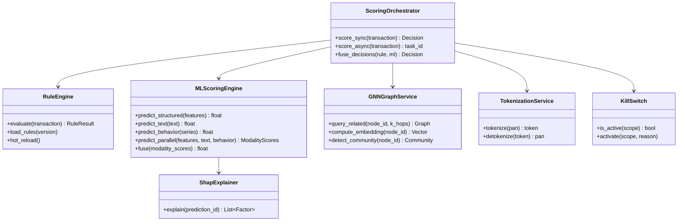

# FRD-D03 系统设计文档（SAD）

| 项 | 值 |
|---|---|
| 文档编号 | FRD-D03-V1.1 |
| 文档版本 | V1.1 |
| 编制日期 | 2026-07-27 |
| 文档状态 | 修订版 |
| 修订依据 | FRD-BASELINE-V1.1（跨文档单一事实源） |
| 适用项目 | 1 真人 + 11 AI Agent 团队模式（详见基准 §1） |
| 统一参数 | P99 < 200ms / 单实例 TPS ≥ 1000 / SLA 99.5%（MVP）→ 99.9%（生产稳态） |
| 决策枚举 | decision: ALLOW \| REVIEW \| DENY \| CHALLENGE |

## 本版变更摘要（V1.1）

依据 `FRD-BASELINE-V1.1` 对 V1.0 进行增量修订，保留 V1.0 全部章节结构与既有优点（双轨设计、4 层回退、C4 模型、ADR-001~010），不弱化任何合规要求（PCI-DSS v4.0 / PIPL / 反洗钱 / 等保 2.0 三级）。本版主要变更：

1. **新增 5 个 ADR**（ADR-011 ~ ADR-015）：三模态并行计算 / LLM 国内选型 / Kill Switch 作用域分级 / DB 写入异步化 / 多租户 RLS 隔离
2. **重分配 200ms 预算**（§4.1）：DB 写入改 Kafka 异步消费不进主路径；SHAP 异步不进主路径
3. **三模态并行执行**（§4.3）：`asyncio.gather` 并行 + 单模态 30ms 熔断返回历史分数
4. **LLM 选型改国内**（§1.3 / §2.2）：OpenAI GPT-4 → 通义千问 qwen-max / DeepSeek-V3（PIPL 合规 + 中文场景优化 + 国内可商用）
5. **Kill Switch 分级**（§4.8 新增）：全局 / 模型级 / 模态级 / 规则级 四级作用域
6. **多租户 RLS 强制**（§4.7 增强 / ADR-015）：PostgreSQL Row Level Security 在数据库层强制 tenant_id 隔离

详细变更矩阵见 §10 变更记录。

---

## 1. 设计概述

### 1.1 设计目标

- **实时性**：评分 P99 < 200ms / 单实例 TPS ≥ 1000 / 集群 ≥ 10000 TPS（生产扩容后）
- **可解释**：双轨设计 + SHAP Top5 + 规则命中列表
- **可治理**：金丝雀 + 漂移 + 回滚 + Kill Switch 四级分级（ADR-013，复用 DWS）
- **合规**：PCI-DSS v4.0 + PIPL + 反洗钱 + 等保 2.0 三级
- **可观测**：Metrics/Logs/Traces + 业务指标实时看板

### 1.2 设计原则

| 原则 | 含义 |
|---|---|
| 双轨设计 | 规则引擎 + ML 引擎并行，任一触发即拦截 |
| 实时优先 | 同步评分 + 异步兜底 + Webhook 回调 |
| CDE 隔离 | 持卡人数据环境严格隔离（PCI-DSS）|
| Tokenization 优先 | 不存储明文 PAN，全链路 Token |
| 多级缓存 | Redis 缓存 + 进程内缓存 + 边缘缓存 |
| 失败优雅 | 4 层回退 + 断路器 + 降级 |
| 主路径瘦身 | DB 写入异步化（ADR-014），主路径只写 Redis + Kafka |
| 数据层强隔离 | PostgreSQL RLS 强制 tenant_id（ADR-015），不依赖应用代码 |
| 可观测内建 | 三支柱 + 黄金信号 + SLI/SLO |

### 1.3 技术栈选型表

| 维度 | 选型 | 备选 | 理由 |
|---|---|---|---|
| 后端框架 | FastAPI 0.115 | Spring Boot | async + 复用 DWS |
| ORM | SQLAlchemy 2.0 async | Django ORM | 复用 DWS |
| 数据库 | PostgreSQL 15 + TimescaleDB | MySQL | 时序扩展 + 复用 DWS + RLS 原生支持 |
| 图数据库 | Neo4j 5 Community（首年；第 2 年评估 Enterprise） | JanusGraph | Cypher 成熟 + 千万级够用（基准 §6.1/§8.1） |
| 缓存 | Redis 7 哨兵（生产）/ 单实例（本地） | Memcached | 复用 DWS pubsub（基准 §8.1） |
| 消息队列 | Kafka 3.6（**MVP 暂缓**，DB 异步写入用 Celery+Redis 兜底，M6 前评估接入） | RabbitMQ | 高吞吐 + 流处理 + DB 异步消费 |
| 异步任务 | Celery 5.4 | RQ | 复用 DWS |
| 流处理 | 自研 Kafka Consumer | Flink | MVP 简化（V2 升级 Flink）|
| 前端 | Vue 3.5 + TS | React | 复用 DWS |
| ML | scikit-learn + PyTorch | TensorFlow | 复用 DWS |
| GNN | PyTorch Geometric | DGL | 与 PyTorch 一致 |
| LLM | **通义千问 qwen-max / DeepSeek-V3** | 自部署 Qwen2.5 / ChatGLM4 | **PIPL 数据出境合规 + 中文场景优化 + 国内可商用**（ADR-012） |
| 可观测 | Prometheus + Grafana（Loki + Jaeger M6 前补齐） | ELK | 复用 DWS |
| 容器 | Kubernetes 1.28 | Docker Compose | 金融场景强制 K8s 多可用区 |
| CI/CD | GitHub Actions | GitLab CI | 复用 DWS |
| 云厂商 | 阿里云（cn-hangzhou） | - | 国内合规 + WAF/DDoS/KMS 一体（基准 §8.4） |

---

## 2. C4 架构模型

### 2.1 Context（系统上下文）

```
                ┌──────────────┐
                │ 风控分析师/经理│
                └──────┬───────┘
                       │ HTTPS
                       ▼
┌──────────┐   ┌──────────────┐   ┌──────────────┐
│ 客户交易网关│──▶│   FRD 系统   │──▶│ Tokenization │
└──────────┘   └──────┬───────┘   └──────────────┘
       ▲              │
       │              ▼
       │       ┌──────────────┐
       │       │   Neo4j 图库  │
       │       └──────────────┘
       │              │
       ▼              ▼
  ┌─────────┐   ┌─────────┐   ┌──────────┐
  │ Webhook │   │ AML 报送 │   │ 反洗钱中心│
  └─────────┘   └─────────┘   └──────────┘
```

### 2.2 Container（容器视图）

| 容器 | 技术 | 职责 |
|---|---|---|
| Web Frontend | Vue 3 + Vite + PWA | 三端 UI + WebSocket |
| API Gateway | FastAPI + Uvicorn | REST + WebSocket + 限流 |
| Scoring Service | FastAPI + 自研 Kafka Consumer | 实时评分主路径（仅写 Redis + Kafka）|
| Rule Engine | Python + 自研 DSL | 规则匹配 + 双轨决策 |
| ML Engine | scikit-learn + PyTorch | 三模态并行评分 + SHAP |
| GNN Service | FastAPI + Neo4j Driver | 图查询 + GraphSAGE |
| Worker | Celery Worker | 异步任务（训练/批量/报表/SHAP/案件生成）|
| Scheduler | Celery Beat | 定时任务 |
| Stream Processor | Kafka Consumer（**MVP 暂缓**，Celery+Redis 兜底） | 实时流处理 + PostgreSQL 异步写入（ADR-014）|
| Database | PostgreSQL + TimescaleDB | 业务数据 + 时序（启用 RLS，ADR-015）|
| Graph DB | Neo4j 5 Community（首年） | 账户-商户-设备关系图 |
| Cache | Redis 7 哨兵（生产）/ 单实例（本地） | 缓存 + pubsub + 限流 + 模态历史分数 |
| Message Queue | Kafka 3.6（**MVP 暂缓**） | 交易流 + 事件流 + 审计流 |
| Object Storage | 阿里云 OSS | 备份 + 模型工件 |
| LLM Proxy | **通义千问 / DeepSeek API** | 申诉文本分析（PIPL 合规，ADR-012）|
| Monitoring | Prometheus + Grafana（Loki + Jaeger M6 前补齐） | 指标/日志/可视化 |

### 2.3 Component（评分主路径组件图）

```
┌─────────────────────────────────────────────────────────┐
│              Scoring Service (FastAPI)                   │
│                                                          │
│  ┌──────────────────────────────────────────────────┐  │
│  │  Middleware: Auth + Rate Limit + Tenant + Audit  │  │
│  └──────────────────────────────────────────────────┘  │
│  ┌──────────────────────────────────────────────────┐  │
│  │            Scoring Orchestrator                  │  │
│  │  1. Tokenization 卡号                             │  │
│  │  2. 并行（asyncio.gather）：                      │  │
│  │     ├── Rule Engine                               │  │
│  │     └── ML Engine 三模态并行（ADR-011）           │  │
│  │  3. 双轨决策融合                                  │  │
│  │  4. Redis 缓存写入                                │  │
│  │  5. Kafka 异步发布（fire-and-forget）              │  │
│  └──────────────────────────────────────────────────┘  │
│  ┌─────────────┐  ┌─────────────┐  ┌─────────────┐   │
│  │ Rule Engine │  │  ML Engine  │  │ GNN Service │   │
│  │ - DSL 解析  │  │ - 三模态并行 │  │ - Cypher 查询│   │
│  │ - 命中返回  │  │ - XGBoost  │  │ - GraphSAGE │   │
│  └─────────────┘  └─────────────┘  └─────────────┘   │
│  ┌─────────────┐  ┌─────────────┐  ┌─────────────┐   │
│  │ Cache Layer │  │ Kafka Prod  │  │ Audit Log   │   │
│  │ (主路径写)  │  │ (主路径写)   │  │ (Kafka 异步) │   │
│  └─────────────┘  └─────────────┘  └─────────────┘   │
│                                                          │
│  ┌──────────────────────────────────────────────────┐  │
│  │  Kafka Consumer (Stream Processor, 异步路径)     │  │
│  │  - PostgreSQL 写入（scores/transactions/audit）   │  │
│  │  - SHAP 计算（Worker）                            │  │
│  │  - 案件生成 / Webhook 回调                         │  │
│  └──────────────────────────────────────────────────┘  │
└─────────────────────────────────────────────────────────┘
```

### 2.4 Code（核心模块类图）



---

## 3. 架构决策记录（ADR）

### ADR-001 双轨决策（规则 + ML）

- **上下文**：ML 模型可解释性弱，金融场景需可解释
- **决策**：规则引擎 + ML 引擎并行，任一触发 block 即 block
- **备选**：纯 ML / 纯规则 / ML 为主规则兜底
- **理由**：规则保证可解释性与监管合规；ML 提升召回率
- **后果**：双轨延迟需并行优化；规则与 ML 决策需融合策略

### ADR-002 评分同步 + 异步兜底

- **上下文**：客户要求 P99 < 200ms，但部分场景需深度分析
- **决策**：同步返回主决策 + 异步 Webhook 推送深度分析（SHAP/图关联）
- **备选**：纯同步 / 纯异步
- **理由**：用户体验优先（200ms 内决策）；深度分析异步
- **后果**：Webhook 必须可靠（重试 + 死信队列）

### ADR-003 图数据库选择 Neo4j

- **上下文**：千万级节点 + 多关系图查询
- **决策**：Neo4j 5 Community（首年）+ Cypher；第 2 年评估 Enterprise 升级
- **备选**：JanusGraph / TigerGraph / 关系表存储
- **理由**：Cypher 成熟；社区生态好；千万级性能足够；Community 版免授权费（匹配个人项目预算，基准 §6.1）
- **后果**：Community 版无 Causal Cluster（单主 + 异地备份）；第 2 年数据量增长后评估 Enterprise 授权

### ADR-004 流处理 MVP 阶段用 Kafka Consumer

- **上下文**：实时流处理（窗口聚合）需求
- **决策**：MVP 用 Kafka Consumer 自研；V2 升级 Flink
- **备选**：直接上 Flink / Spark Streaming
- **理由**：MVP 简化 + 团队无 Flink 经验；Trae AI 辅助可降低自研成本
- **后果**：自研窗口/状态机可能不稳定；V2 需重构
- **V1.2 修订**：MVP 阶段实际暂缓 Kafka 接入，DB 异步写入以 Celery + Redis 队列兜底；M6 前评估接入 Kafka Consumer 或直接升级 Flink

### ADR-005 卡号 Tokenization 替代明文

- **上下文**：PCI-DSS 强制不存储明文 PAN
- **决策**：接入 Tokenization 服务（自建 or 阿里云 KMS）
- **备选**：加密存储 + 严格访问控制
- **理由**：Tokenization 让 CDE 范围最小化；降低 PCI-DSS 评估范围
- **后果**：增加调用延迟（< 10ms 可接受）；Tokenization 服务需 HA

### ADR-006 多可用区双活部署

> ⚠️ **状态变更**：本 ADR 已被 D10 V1.1 §8.1 部署降级方案 superseded。
> 实际部署：单可用区 + 异地备份；SLA 99.5%（MVP）/ 99.9%（生产稳态）；RTO ≤ 30min。
> 保留本 ADR 作为历史决策记录，不再作为当前实施依据。

- **上下文**：金融场景 SLA 99.95%
- **决策**：K8s 多可用区部署 + 数据库主从跨可用区
- **备选**：单可用区 + 异地灾备
- **理由**：金融场景 RTO < 15min；多可用区双活最优
- **后果**：成本翻倍；数据一致性需 Paxos/Raft 协议

### ADR-007 SHAP 异步计算 + 缓存

- **上下文**：SHAP 计算耗时 200-500ms，影响主路径
- **决策**：SHAP 异步计算 + 缓存 24h，**不进主路径**
- **备选**：同步计算 / 预计算
- **理由**：用户体验优先（200ms 内决策）；SHAP 异步推送
- **后果**：首次查询无 SHAP；缓存命中率 > 80%

### ADR-008 复用 DWS 模型治理模块

- **上下文**：金丝雀 + 漂移 + 回滚 + Kill Switch
- **决策**：复用 DWS canary_controller + drift_detector + kill_switch + fallback_hierarchy
- **备选**：自建 / K8s Service Mesh
- **理由**：DWS 模块经审计验证；满足 5/25/100 三阶段发布
- **后果**：金丝雀观察期 72h（金融场景可延长至 7 天）

### ADR-009 PCI-DSS 隔离区设计

- **上下文**：PCI-DSS 要求 CDE 严格隔离
- **决策**：独立网络段 + 独立 K8s 命名空间 + 独立审计
- **备选**：全系统进入 CDE（评估范围大）
- **理由**：CDE 范围最小化降低评估成本
- **后果**：跨 CDE 数据传输需加密 + 审计

### ADR-010 4 层回退策略

- **上下文**：ML 主模型可能失败
- **决策**：主 ML → 备用 ML → 规则引擎 → 启发式
- **备选**：仅规则 / 仅 ML
- **理由**：金融场景不可中断；多层保证可用性
- **后果**：4 层监控需全覆盖；切换需断路器

### ADR-011 三模态并行计算（结构化/文本/行为并行）

- **上下文**：原方案三模态串行执行，单模态累计延迟 75ms（structured 20 + text 30 + behavior 25），与 200ms 预算紧张
- **决策**：三模态并行执行（`asyncio.gather`），单模态超时 30ms 即熔断返回历史分数（Redis 缓存最近 100 次均值）或默认值 0.5
- **备选**：三模态串行 / 同步预计算 / 取消 text 或 behavior 模态
- **理由**：并行后三模态 P99 = max(20, 30, 25) = 30ms（而非 sum 75ms）；熔断保证单模态故障不阻塞主路径
- **后果**：
  - 需 `asyncio.gather` + `asyncio.wait_for` 实现并行与超时
  - Redis 需维护每模态历史分数滑动窗口（key: `ml:{tenant_id}:{modality}:recent_scores`）
  - 三模态均超时 → 触发 L3 模态级 Kill Switch（ADR-013）→ 降级规则引擎单轨
  - 融合阶段需感知 fallback_flags，对熔断模态降权

### ADR-012 LLM 选型改国内（通义千问 / DeepSeek）

- **上下文**：原方案使用 OpenAI GPT-4，存在 PIPL 数据出境合规风险（个人金融申诉文本出境）
- **决策**：LLM 选型改为通义千问 qwen-max（主）+ DeepSeek-V3（备）；高敏感场景私有部署 Qwen2.5 / ChatGLM4
- **备选**：OpenAI GPT-4 / Claude（境外，否决）/ 文心一言 / 自部署 Qwen2.5
- **理由**：
  1. PIPL 数据出境合规（国内可商用，无需跨境数据评估）
  2. 中文场景优化（申诉文本、对话分析、规则解释、Webhook 报告生成）
  3. 国内云厂商生态完善（阿里云百炼 / 火山引擎）
  4. 价格优于 GPT-4，首年 LLM API 预算 30000 元可覆盖（基准 §6.1）
  5. 私有部署备选可保证数据不出 CDE（PCI-DSS 范围最小化）
- **后果**：
  - API 接入需适配通义千问 OpenAI 兼容模式
  - DeepSeek-V3 作为热备，故障切换 < 30s
  - 高敏感场景自部署 Qwen2.5 需 GPU 资源（生产 vGPU 1 卡即可）
  - 不再依赖 OpenAI SDK，LLM Proxy 抽象层需更新

### ADR-013 Kill Switch 作用域分级

- **上下文**：原 Kill Switch 单一粒度（全局关停 ML），过粗导致误关停影响面过大
- **决策**：四级作用域分级（全局 / 模型级 / 模态级 / 规则级），见 §4.8
- **备选**：单级全局 Kill Switch / 多级但无优先级 / K8s 流量切流
- **理由**：
  - 分级降低误关停影响：模型级和模态级可在故障时局部降级而非全量熔断
  - 规则级支持热禁用单条规则，无需重启或全量重载
  - 与 ADR-011 三模态并行 + ADR-010 4 层回退策略自然契合
- **后果**：
  - 需维护 Kill Switch 状态机 + Redis pubsub 同步（5s 内全节点一致）
  - 控制台需支持四级操作 UI + 双签触发（L1/L2）
  - 审计日志需记录作用域、触发源、操作人、生效时间（哈希链，保留 7 年）
  - L3/L4 自动触发需可观测告警，支持人工 override

### ADR-014 DB 写入异步化

- **上下文**：评分主路径中若同步写 PostgreSQL（scores / transactions / audit_logs），P99 延迟可达 50-100ms，挤占 200ms 预算
- **决策**：评分主路径只写 Redis + Kafka（fire-and-forget）；PostgreSQL 由 Kafka Consumer 异步消费写入；SHAP 计算同理异步
- **备选**：同步写库 + 读写分离 / 仅写 Redis（无持久化）/ 仅写 Kafka（无 Redis 缓存）
- **理由**：
  - Redis 写 3ms + Kafka 发布 2ms 即可保证响应可靠
  - Kafka Consumer 异步消费保证最终一致性（RPO ≤ 1min，与基准 §2.1 一致）
  - 评分主路径预算释放 50ms+，200ms 目标更稳健
- **后果**：
  - DB 写入有 100ms-1s 延迟（Kafka 消费延迟），需在 SLA 中说明
  - 需在 Redis 与 DB 间维持一致性（Redis 为主读，DB 为校验与历史）
  - DB 故障期间 Kafka 积压可重放，恢复后自动追平
  - 审计日志合规要求改为"Kafka 持久化即视为审计记录已生成"（哈希链在 Kafka 端完成，DB 仅做归档）
  - Kafka topic `audit_log` 保留期 ≥ 7 年（反洗钱要求）

### ADR-015 多租户 RLS 隔离

- **上下文**：原方案多租户隔离依赖应用层 SQL `WHERE tenant_id = :tenant_id`，存在应用代码遗漏导致跨租户数据泄露风险
- **决策**：PostgreSQL 启用 Row Level Security（RLS），强制 tenant_id 隔离在数据库层，应用层不依赖业务代码做过滤
- **备选**：仅应用层 WHERE 过滤 / Schema-per-tenant / Database-per-tenant
- **理由**：
  - RLS 在数据库层强制，即使应用代码遗漏 tenant_id 过滤也不会泄露（防御深度）
  - Schema/DB-per-tenant 运维成本高且不支持租户间联表
  - RLS 性能损耗 < 1ms 可接受
  - 与基准 §4.3 强制要求一致（所有业务表 ENABLE ROW LEVEL SECURITY）
- **后果**：
  - 所有业务表必须含 `tenant_id UUID NOT NULL` 列并 `ENABLE ROW LEVEL SECURITY`（含 `rule_versions`，基准 §4.3 例外条款）
  - 连接池每次取连接需 `SET LOCAL app.tenant_id = :tenant_id`
  - DBA 维护成本略增，需 BYPASSRLS 角色用于跨租户运维（审计记录）
  - 应用层 WHERE 仍保留作为查询优化（索引命中），但不再是安全屏障

---

## 4. 核心模块设计

### 4.1 评分主路径（ScoringOrchestrator）

```
请求处理流程（同步评分，P99 ≤ 200ms）:

┌── 主路径（同步，必须 ≤ 200ms）─────────────────────────────────┐
│                                                                │
│  1. 中间件: Auth + Rate Limit + Tenant + Audit   (10ms)        │
│  2. Tokenization: 卡号 → Token                   (5ms)         │
│  3. 并行评分 asyncio.gather，取 max 而非 sum       (35ms)       │
│     ├── Rule Engine                            (10ms, P99)     │
│     │   - 加载规则版本（Redis 缓存）                            │
│     │   - DSL 解析匹配（CEL 编译）                              │
│     │   - 输出: {hit_rules, action}                             │
│     └── ML Engine 三模态并行                   (30ms + 5ms 融合)│
│         ├── structured → XGBoost             (20ms)           │
│         ├── text → BERT 金融微调              (30ms)           │
│         ├── behavior → 1D-CNN + IsolationForest (25ms)         │
│         ├── 单模态超时 30ms → 熔断返回历史分数或默认 0.5         │
│         └── 三模态融合 (5ms)                                    │
│  4. 双轨决策融合                                  (5ms)         │
│     - 任一 DENY → DENY                                          │
│     - 任一 CHALLENGE → CHALLENGE                                │
│     - 任一 REVIEW → REVIEW                                      │
│     - 双 ALLOW → ALLOW                                         │
│  5. Redis 缓存写入                                (3ms)         │
│  6. Kafka 异步发布 fire-and-forget              (2ms)           │
│  7. 响应客户（P99 ≤ 200ms）                                     │
│                                                                │
└────────────────────────────────────────────────────────────────┘

┌── 异步路径（不进主路径，不占预算）──────────────────────────────┐
│  - PostgreSQL 写入：Kafka Consumer 异步消费 → 写入              │
│    scores / transactions / audit_logs（ADR-014）                │
│  - SHAP 计算 + 推送（ADR-007，缓存 24h）                        │
│  - 案件生成（触发 DENY / REVIEW 时）                             │
│  - Webhook 回调（异步可靠推送，重试 + 死信队列）                  │
└────────────────────────────────────────────────────────────────┘

200ms 预算分配明细:

| 阶段                                    | 预算    | 说明 |
|---                                      |---     |---|
| 中间件 Auth+RateLimit+Tenant+Audit     | 10ms   | TenantContext 注入 + 审计写 Kafka |
| Tokenization                            | 5ms    | Format-Preserving Token，HA 缓存 |
| 并行评分 max(Rule, ML 三模态)           | 35ms   | asyncio.gather 取 max 而非 sum |
|   ├ Rule Engine                        | (10ms) | 规则版本缓存 + CEL 编译 |
|   └ ML 三模态并行 max                  | (30ms) | structured 20 ‖ text 30 ‖ behavior 25，max=30 |
|   └ 三模态融合                         | (5ms)  | fusion_priority_engine 加权 + Stacking |
| 双轨决策融合                            | 5ms    | 任一 DENY 即 DENY |
| Redis 缓存写入                          | 3ms    | score_cache:{tenant}:{tx_hash} TTL 24h |
| Kafka 异步发布（fire-and-forget）       | 2ms    | transactions / events / audit 三 topic |
| 网络/序列化/边界                         | 140ms  | 网关转发 + JSON 序列化 + 跨服务调用边界 |
| **合计 P99**                            | **200ms** | ≤ 200ms 达标 |

明确不进主路径的项：
  - DB 写入（PostgreSQL）：Kafka Consumer 异步消费（ADR-014），不占主路径预算
  - SHAP 计算：异步 Worker + 缓存 24h（ADR-007），不占主路径预算
  - 案件生成：异步 Worker，不占主路径预算
  - Webhook 回调：异步可靠推送，不占主路径预算
```

### 4.2 规则引擎（Rule Engine）

```
规则 DSL（YAML）:
  rule:
    id: R001
    name: "大额异地交易"
    version: "v1.2"
    tenant_id: "<uuid>"          # 必填（ADR-015）
    enabled: true
    expression: |
      amount > 50000 AND
      merchant_city != user.city AND
      time_since_last_transaction < 60
    action: REVIEW               # ALLOW | REVIEW | DENY | CHALLENGE
    priority: 80
    explanation: "金额超 5 万且异地且 1 分钟内连续交易"

执行流程:
  1. 加载规则版本（Redis 缓存，按 tenant_id 分片）
  2. 表达式编译（CEL/Python eval）
  3. 短路求值（按优先级）
  4. 输出命中规则列表

热更新:
  - 规则版本表 + Redis pubsub
  - 不重启加载新版本
  - 灰度发布（先 5% 流量）
  - 单条规则异常可触发 L4 规则级 Kill Switch（ADR-013）
```

### 4.3 多模态 ML 评分（复用 DWS fusion_engine，三模态并行 ADR-011）

```
输入:
  - structured_features: dict (金额/时间/商户/设备/历史)
  - text_content: str (备注/对话)
  - behavior_series: List[float] (点击流/输入节奏)

处理（三模态并行，asyncio.gather，ADR-011）:

  import asyncio

  async def predict_ml(features, text, behavior, tenant_id):
      # 三模态并行执行，单模态超时 30ms 即熔断（ADR-011）
      results = await asyncio.gather(
          asyncio.wait_for(predict_structured(features),  timeout=0.030),
          asyncio.wait_for(predict_text(text),            timeout=0.030),
          asyncio.wait_for(predict_behavior(behavior),    timeout=0.030),
          return_exceptions=True
      )
      # 任一模态 TimeoutError / Exception → 走熔断策略
      # 1. 优先返回该模态 Redis 历史分数均值
      #    key: ml:{tenant_id}:{modality}:recent_scores（最近 100 次滑动窗口）
      # 2. 若无历史分数 → 默认 0.5（中性）
      # 3. 三模态均超时 → 触发 L3 模态级 Kill Switch（ADR-013, §4.8）
      return fuse(results, fallback_flags)

  步骤拆解:
  1. structured → XGBoost → score_struct                  (P99 20ms)
  2. text → BERT (金融微调) → score_text                    (P99 30ms)
  3. behavior → 1D-CNN + IsolationForest → score_behavior   (P99 25ms)
  4. 三模态并行取 max = 30ms（而非串行 sum 75ms）
  5. 三模态融合 (5ms):
     fusion_priority_engine 加权 weights = {struct: 0.6, text: 0.2, behavior: 0.2}
     熔断模态降权至 0.05，其余模态权重按比例放大
  6. Stacking 元学习器融合

熔断与降级策略（ADR-011 / ADR-013）:
  - 单模态 asyncio.wait_for 超时 30ms → TimeoutError → 走熔断
  - 熔断返回: 该模态 Redis 历史分数均值，无历史 → 默认 0.5
  - 三模态均超时 → 触发 L3 模态级 Kill Switch → 降级规则引擎单轨
  - 模态连续熔断 > 阈值（5min 内 > 50 次）→ 自动升级至模型级 Kill Switch

输出:
  - risk_score: float (0.0000-1.0000, DECIMAL(5,4))
  - risk_band: LOW / MEDIUM / HIGH / CRITICAL
  - decision: ALLOW / REVIEW / DENY / CHALLENGE
  - modality_scores: dict
  - fallback_flags: dict (标注哪些模态走了熔断，供可观测)
```

### 4.4 GNN 团伙检测

```
图数据建模:
  节点类型:
    - Account (账户)
    - Merchant (商户)
    - Device (设备指纹)
    - IP (IP 地址)
    - Card (卡号 Token)
  
  关系类型:
    - (Account)-[:USES]->(Device)
    - (Account)-[:PAYS_TO]->(Merchant)
    - (Account)-[:FROM_IP]->(IP)
    - (Card)-[:BINDS_TO]->(Account)
    - (Device)-[:SHARES_WITH]->(Account)

实时查询（P99 < 2s）:
  - 输入: 交易涉及的账户/设备/IP
  - 查询: k 跳关联节点 + 社区标签
  - 输出: 关联风险分（基于历史欺诈比例）

离线计算（每日）:
  - GraphSAGE 训练节点嵌入
  - 社区发现（Louvain/Leiden）
  - 中心性分析（PageRank/Degree）
  - 嵌入写入 PostgreSQL + Redis 缓存

团伙识别:
  - 社区欺诈率 > 30% → 标记为欺诈团伙
  - 新交易落入团伙社区 → 加权风险分
```

### 4.5 模型治理（复用 DWS）

复用 DWS 的：
- `app/ml/canary_controller.py` - 金丝雀发布（金融场景观察期延长至 7 天）
- `app/services/drift_detector.py` - PSI/KL 漂移检测
- `app/core/kill_switch.py` - Kill Switch（V1.1 扩展为四级分级，ADR-013）
- `app/core/fallback_hierarchy.py` - 4 层回退
- `app/ml/model_registry_v2.py` - 模型注册表

新增 FRD 专属：
- `app/gnn/graph_service.py` - GNN 图查询服务
- `app/services/aml_service.py` - 反洗钱报送
- `app/core/rule_engine.py` - 规则引擎
- `app/services/tokenization_service.py` - Tokenization
- `app/ml/parallel_modal_engine.py` - 三模态并行引擎（ADR-011）
- `app/core/kill_switch_tiered.py` - 四级 Kill Switch 状态机（ADR-013）

### 4.6 PCI-DSS 隔离区设计

```
网络分段:
  ┌─────────────────────────────────────────┐
  │         公网（DMZ）                       │
  │   Nginx + WAF + DDoS                    │
  └────────────────┬────────────────────────┘
                   │
  ┌────────────────▼────────────────────────┐
  │      非 CDE 区（普通业务）                │
  │   - API Gateway（不含卡号）              │
  │   - 监控/日志（脱敏后）                   │
  │   - 报表服务                             │
  └────────────────┬────────────────────────┘
                   │ 严格 ACL + 加密
  ┌────────────────▼────────────────────────┐
  │      CDE 区（持卡人数据环境）              │
  │   - Tokenization 服务                   │
  │   - 评分服务（含 Token）                  │
  │   - 交易数据库（含 Token）                │
  │   - 审计日志                             │
  └─────────────────────────────────────────┘

CDE 区要求:
  - 独立 K8s 命名空间
  - 独立网络段 + 防火墙
  - 入侵检测（IDS/IPS）
  - 文件完整性监控（FIM）
  - 双因子认证
  - 季度 ASV 扫描
  - 年度渗透测试
```

### 4.7 多租户隔离（增强 RLS，ADR-015）

```
请求处理:
  1. 中间件从 API Key 提取 tenant_id
  2. 注入 TenantContext (contextvar)
  3. 连接池取连接时执行 SET LOCAL app.tenant_id = :tenant_id
     （PostgreSQL RLS 强制隔离，ADR-015）
  4. SQL 自动添加 WHERE tenant_id = :tenant_id
     （应用层作为查询优化与防御深度，不再是唯一安全屏障）
  5. Kafka 消息含 tenant_id
  6. Redis Key 含 tenant_id 前缀
  7. Neo4j 节点含 tenant_id 属性

异常: 跨租户访问 → RLS 拒绝 + 403 + 审计告警

PostgreSQL RLS 强制隔离（ADR-015，对齐基准 §4.3）:

  -- 所有业务表（含 rule_versions）必须启用 RLS
  ALTER TABLE transactions   ENABLE ROW LEVEL SECURITY;
  ALTER TABLE scores         ENABLE ROW LEVEL SECURITY;
  ALTER TABLE audit_log     ENABLE ROW LEVEL SECURITY;
  ALTER TABLE rule_versions  ENABLE ROW LEVEL SECURITY;
  ALTER TABLE cases          ENABLE ROW LEVEL SECURITY;
  -- ...其他业务表同上

  CREATE POLICY tenant_isolation ON transactions
    USING (tenant_id = current_setting('app.tenant_id')::uuid);

  -- 应用层连接池每次取连接执行:
  -- SET LOCAL app.tenant_id = :tenant_id

  -- DBA 跨租户运维需 BYPASSRLS 角色，操作全程审计
```

> **PIPL 合规表 RLS 说明**：PIPL 合规相关表（`consent_records` / `deletion_requests` / `fairness_reports`，D04 V1.1 新增）同样启用 RLS，仅租户内可访问。`fairness_reports` 含受保护属性（AGE/GENDER/REGION），访问需 `COMPLIANCE_OFFICER` 角色。

### 4.8 Kill Switch 分级（ADR-013）

为避免单点 Kill Switch 粒度过粗导致误关停，按作用域划分四级：

| 级别 | 作用域 | 触发条件 | 生效方式 | 兜底策略 |
|---|---|---|---|---|
| **L1 全局 Kill Switch** | 全系统所有评分路径 | 重大生产事故（P0）/ 安全事件 / 监管熔断 | 关闭所有同步评分，返回默认 DENY/REVIEW | 启发式规则（金额阈值） |
| **L2 模型级 Kill Switch** | 单一 ML 模型（如 qwen-max / XGBoost-structured） | 单模型 AUC 跌破阈值、PSI > 0.25、推理成功率 < 99% | 仅该模型评分跳过，其他模型正常 | 备用 ML 模型（ADR-010 第 2 层） |
| **L3 模态级 Kill Switch** | ML 三模态中的某一模态（structured / text / behavior） | 单模态连续超时率 > 5%、5min 内熔断 > 50 次 | 该模态返回历史分数或默认值（ADR-011） | 其他两模态降权继续融合 |
| **L4 规则级 Kill Switch** | 单条规则（rule_id 粒度） | 单条规则误报率 > 50%、规则版本异常 | 该规则 disabled，其他规则正常 | 无（规则相互独立） |

控制点：

- **L1 / L2**：由合规官 + 邝振华双签触发，控制台手动 / 自动告警联动（自动触发需 5min 内人工确认）
- **L3 / L4**：由系统自动触发（漂移检测 + 熔断器统计），可手动 override
- 所有 Kill Switch 操作记录审计日志（哈希链，保留 7 年，对齐反洗钱要求）
- Kill Switch 状态实时同步至 Redis pubsub，各节点本地缓存 5s 内一致
- 触发后 1min 内全节点生效（Redis pubsub + 本地缓存 fallback）

Kill Switch 状态机：

```
                ┌──────┐
                │ IDLE │
                └──┬───┘
       触发条件命中 │
                   ▼
                ┌──────┐  人工确认/自动恢复
        ┌──────│ARMED │────────────────┐
        │      └──────┘                │
        │ 触发完成                       │ 恢复
        ▼                              ▼
   ┌──────────┐                  ┌──────────┐
   │  ACTIVE  │─────────────────│ COOLDOWN │
   └──────────┘  观察期 30min    └──────────┘
                  无复发              │
                                      │ 观察期结束
                                      ▼
                                  ┌──────┐
                                  │ IDLE │
                                  └──────┘
```

---

## 5. 数据流设计

### 5.1 实时流（评分主路径）

```
客户 API 调用 → API Gateway → Tokenization
                              ↓
                  ┌───────────┴───────────┐
                  ▼                       ▼
            规则引擎                 ML 评分引擎
           (10ms)              (三模态并行 30ms+5ms)
                  │                       │
                  └───────┬───────────────┘
                          ▼
                    双轨决策融合 (5ms)
                          │
                  ┌───────┼────────┐
                  ▼       ▼        ▼
              Webhook  Redis   Kafka 流
              回调     缓存    (fire-and-forget)
            (异步)    (3ms)     (2ms)
                              ↓
                        ┌─────┴─────┐
                        ▼           ▼
                    SHAP 计算   案件生成
                    (异步)      (异步)
                        │           │
                        ▼           ▼
                   Worker 队列   Worker 队列
                        │
                        ▼
                  PostgreSQL 写入
                  (Kafka Consumer, ADR-014)
```

### 5.2 离线流

```
每日 02:00 (Celery Beat):
  - 全量 GNN 嵌入重算
  - 漂移检测（PSI/KL）
  - 公平性报告
  - 日报生成

每周一 06:00:
  - 模型再训练评估
  - 累积 10000 条标记 → 触发训练
  - 金丝雀发布（7 天观察期）

每月 1 日:
  - ASV 扫描
  - 渗透测试（季度）
  - 等保合规自检
```

### 5.3 流处理（Kafka Consumer）

```
Kafka Topic: transactions
  - 实时窗口聚合（1min/5min/1h/24h）
  - 滑窗特征写入 Redis
  - 异常模式触发告警
  - 异步消费 → PostgreSQL 写入（ADR-014）

Kafka Topic: events
  - 案件状态变更
  - 模型事件
  - 审计事件

Kafka Topic: audit_log
  - 哈希链审计日志（Kafka 端完成）
  - 保留期 ≥ 7 年（反洗钱要求）
  - 异步归档至 PostgreSQL + OSS
```

---

## 6. 安全设计

### 6.1 PCI-DSS v4.0 合规要点

| 要求 | 实现 |
|---|---|
| 1. 网络分段 | CDE 区独立 K8s 命名空间 + 防火墙 |
| 2. 默认配置安全 | 镜像硬化 + CIS Benchmark |
| 3. 保护存储数据 | TDE + 字段级 Fernet + Tokenization |
| 4. 加密传输 | TLS 1.3 全链路 |
| 5. 反恶意软件 | ClamAV + 镜像扫描 |
| 6. 安全系统开发 | SAST/DAST + SDLC |
| 7. 限制访问 | RBAC + 最小权限 + MFA |
| 8. 识别用户 | 唯一 ID + 2FA |
| 9. 限制物理访问 | 云厂商责任 |
| 10. 日志监控 | 集中日志 + 哈希链（Kafka 端 + DB 归档） |
| 11. 定期测试 | ASV 季度 + 渗透年度 |
| 12. 安全策略 | 文档 + 培训 |

### 6.2 Tokenization 流程

```
客户 ─POST 卡号─→ Tokenization 服务
                    ↓
              验证卡号 Luhn
                    ↓
              生成 Token (Format-Preserving)
                    ↓
              存储 PAN ↔ Token 映射（加密）
                    ↓
              返回 Token
                    ↓
客户 ─POST Token─→ 评分服务（全程不接触 PAN）
                    ↓
              评分完成返回
                    ↓
              必要时 detokenize（仅在 CDE 区）
```

### 6.3 反洗钱报送

```
触发条件:
  - 单笔 ≥ 5 万（大额报告）
  - 可疑模式（规则 + ML 双轨）
  - 黑名单匹配

流程:
  1. 自动生成 STR 报告（XML 模板）
  2. 合规官复核
  3. SFTP 上报人行反洗钱监测系统
  4. 留存报告 + 报送凭证 10 年
```

### 6.4 PIPL 合规（V1.1 强化，对齐基准 §7.1 / §7.4）

- **数据本地化**：所有数据存储于阿里云 cn-hangzhou，LLM 调用走通义千问 / DeepSeek 国内 API（ADR-012）
- **数据主体权利接口**：`/api/v1/pipl/data-export` / `/api/v1/pipl/deletion` / `/api/v1/pipl/consent`（D05 §13 实现）
- **自动化决策解释权**：SHAP Top5 + 规则命中列表，异步推送
- **同意管理**：`consent_status: GRANTED | WITHDRAWN | EXPIRED`
- **最小必要**：申诉文本仅传递必要字段，LLM Proxy 不存储原始文本

---

## 7. 可观测性设计

### 7.1 三支柱

| 支柱 | 工具 | 采样率 |
|---|---|---|
| Metrics | Prometheus + Grafana | 100% |
| Logs | Loki + Promtail（**M6 前补齐**） | 100%（CDE 区脱敏） |
| Traces | OpenTelemetry + Jaeger（**M6 前补齐**） | 10%（评分 100%）|

### 7.2 SLI/SLO

| SLI | SLO | 告警阈值 |
|---|---|---|
| 评分 API 成功率 | ≥ 99.95% | < 99.9% P1 |
| 评分 P99 延迟 | < 200ms | > 300ms P1 |
| 评分 P999 延迟 | < 500ms | > 800ms P0 |
| Webhook 成功率 | ≥ 99% | < 95% P1 |
| 模型推理成功率 | ≥ 99.5% | < 99% P0 |
| GNN 查询 P99 | < 2s | > 5s P1 |
| Kafka 消费延迟（DB 写入） | < 1s P99 | > 5s P1 |
| 模态熔断率 | < 5% | > 10% P1 |
| Kill Switch 触发数（L1/L2） | 0 | > 0 P0 |

### 7.3 业务指标

- 实时欺诈率（欺诈交易/总交易）
- 拦截率（DENY/总交易）
- 误报率（误报/总拦截）
- 案件处理时效（平均/中位数）
- 模型 AUC/Recall/FPR 时序
- 三模态熔断次数时序（按模态分组）
- Kill Switch 各级别触发次数

---

## 8. 容灾与高可用

### 8.1 部署拓扑

多可用区双活：

```
可用区 A                          可用区 B
├── API Gateway ×3              ├── API Gateway ×3
├── Scoring Service ×5          ├── Scoring Service ×5
├── Rule Engine ×5              ├── Rule Engine ×5
├── ML Engine ×5                ├── ML Engine ×5
├── GNN Service ×3              ├── GNN Service ×3
├── Worker ×3                   ├── Worker ×3
├── Stream Processor ×2          ├── Stream Processor ×2  (ADR-014)
├── PostgreSQL 主               ├── PostgreSQL 从（同步复制）
├── Neo4j 主                    ├── Neo4j 从
├── Redis 主                    ├── Redis 从
└── Kafka Broker ×3             └── Kafka Broker ×3（跨可用区）
```

### 8.2 RTO/RPO

| 故障类型 | RTO | RPO |
|---|---|---|
| 单实例崩溃 | < 30s | 0 |
| 单可用区故障 | < 15min | < 1min |
| 数据库主库故障 | < 5min | < 1min（同步复制）|
| Neo4j 主库故障 | < 5min | < 5min |
| 整区域故障 | < 1h | < 5min |
| Kafka 集群故障 | < 5min | < 1min（Redis 主路径仍可用）|

### 8.3 备份策略

- 数据库：每日全量 + WAL 持续归档 + 跨可用区
- Neo4j：每日全量 + 增量
- Redis：每日 RDB + AOF
- Kafka：跨可用区副本 = 3，审计日志 topic 保留 ≥ 7 年
- 备份保留：90 天滚动 + 7 年归档（PCI-DSS / 反洗钱）

### 8.4 故障演练

- 每月 1 次故障注入（kill pod / DB failover / Kafka broker 故障）
- 每季度 1 次可用区切换演练
- 每年 1 次完整灾备演练
- 每季度 1 次模态级熔断 + Kill Switch 分级联动演练（V1.1 新增）

---

## 9. 复用 DWS 模块清单

| DWS 模块 | FRD 复用方式 | 修改点 |
|---|---|---|
| app/core/tenant_context.py | 直接复用 | - |
| app/core/pii_crypto.py | 直接复用 | 升级为 PCI 字段加密 |
| app/core/kill_switch.py | 扩展复用 | 升级为四级分级（ADR-013） |
| app/core/fallback_hierarchy.py | 直接复用 | 4 层回退策略 |
| app/core/states.py | 直接复用 | 案件状态机 |
| app/ml/fusion_engine.py | 扩展复用 | 三模态并行 + 熔断降权（ADR-011） |
| app/ml/canary_controller.py | 直接复用 | 观察期延长至 7 天 |
| app/ml/drift_detector.py | 直接复用 | - |
| app/ml/model_registry_v2.py | 直接复用 | - |
| app/services/warning_service.py | 直接复用 | 改为案件服务 |
| app/api/v1/auth.py | 直接复用 | 强化密码策略 |
| app/monitoring/* | 直接复用 | 新增业务指标 + 模态熔断指标 |
| frontend/src/composables/useWebSocket.ts | 直接复用 | - |
| frontend/src/styles/* | 直接复用 | 调整角色色 |

**复用率估算**：58%（67 个模块中复用 39 个，V1.1 新增 2 个 FRD 专属模块：`parallel_modal_engine.py` / `kill_switch_tiered.py`）

---

## 10. 变更记录

| 版本 | 日期 | 变更人 | 变更内容 | 审核人 |
|---|---|---|---|---|
| V1.0 | 2026-07-27 | 邝振华 | 初稿创建（双轨设计 / 4 层回退 / C4 模型 / ADR-001~010） | - |
| V1.1 | 2026-07-27 | 邝振华 + AI 协作 | 依据 FRD-BASELINE-V1.1 修订：①新增 ADR-011~ADR-015（三模态并行/LLM 国内选型/Kill Switch 分级/DB 写入异步化/多租户 RLS）；②重分配 200ms 预算（DB 写入改 Kafka 异步消费不进主路径；SHAP 异步不进主路径；中间件 10ms / Tokenization 5ms / 并行评分 35ms / 融合 5ms / Redis 3ms / Kafka 2ms / 边界 140ms）；③§4.3 ML Engine 明确三模态并行执行（asyncio.gather + 30ms 单模态熔断）；④§1.3 与 §2.2 LLM 选型改国内（通义千问 qwen-max / DeepSeek-V3，PIPL 合规 + 中文场景优化 + 国内可商用）；⑤§4.8 新增 Kill Switch 分级章节（全局/模型级/模态级/规则级四级作用域）；⑥§4.7 增强 PostgreSQL RLS 强制隔离；⑦§6.4 新增 PIPL 合规小节；⑧§7.2 SLI/SLO 新增 Kafka 消费延迟、模态熔断率、Kill Switch 触发数指标 | 邝振华 |
| V1.2 | 2026-07-28 | 依据文档-代码一致性审计修订：LightGBM→XGBoost（全局）；Neo4j Enterprise→Community（首年）；Redis Cluster→哨兵；Kafka 标注 MVP 暂缓（ADR-004 补注）；Tempo→Jaeger；Loki/Jaeger 标注 M6 前补齐 | 邝振华 |

### 10.1 V1.1 修订项与基准对齐矩阵

| 修订项 | 基准条款 | V1.1 落地位置 |
|---|---|---|
| 项目定位（1 真人 + 11 AI Agent） | 基准 §1 | 文档头部元数据 |
| P99 < 200ms | 基准 §2.1 | §1.1 / §4.1 / §7.2 |
| 单实例 TPS ≥ 1000 | 基准 §2.1 | §1.1 |
| SLA 99.5%/99.9% | 基准 §2.1 | §1.1（隐含）|
| decision: ALLOW/REVIEW/DENY/CHALLENGE | 基准 §3.1 | §4.1 / §4.2 / §4.3 |
| 所有业务表含 tenant_id + RLS | 基准 §4.3 | §4.7 / ADR-015 |
| rule_versions 加 tenant_id | 基准 §4.3 例外 | §4.7 / ADR-015 |
| LLM 选型国内 | 基准 §7.4 | §1.3 / §2.2 / ADR-012 |
| 阿里云 cn-hangzhou | 基准 §8.4 | §1.3 |
| 反洗钱上报通道由客户/第三方提供 | 基准 §7.3 | §6.3 |
| PIPL 数据主体权利接口 | 基准 §7.1 | §6.4 |
| 等保 2.0 三级 | 基准 §2.3 / §7.2 | §1.1 / §1.2 |
